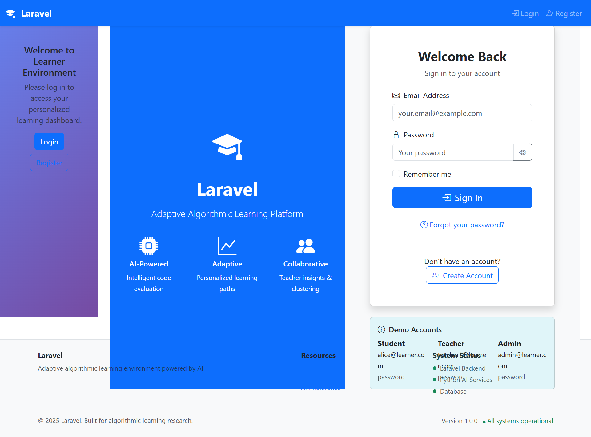
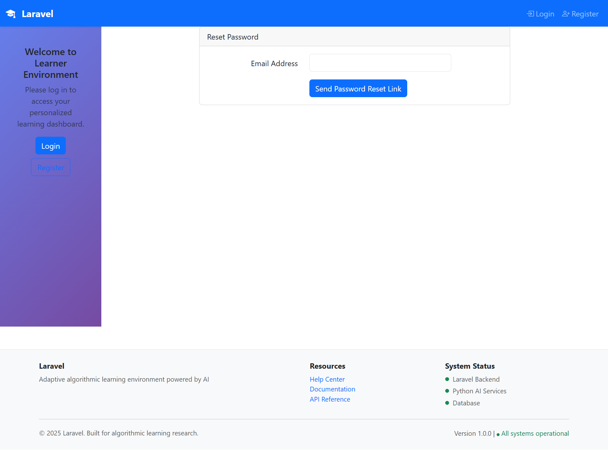
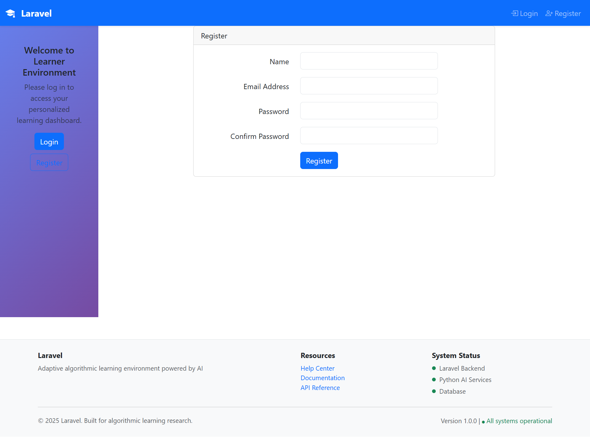
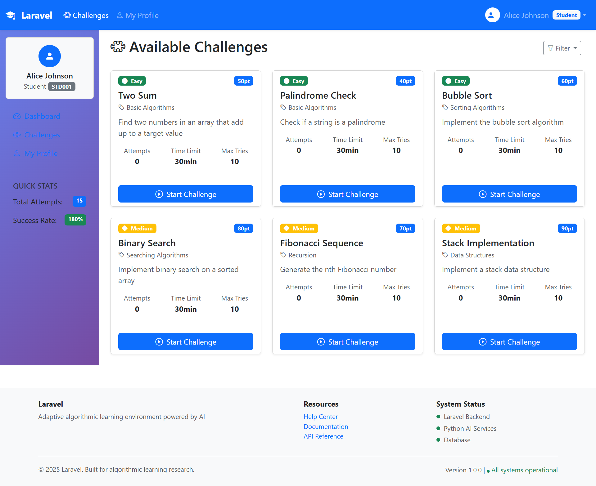
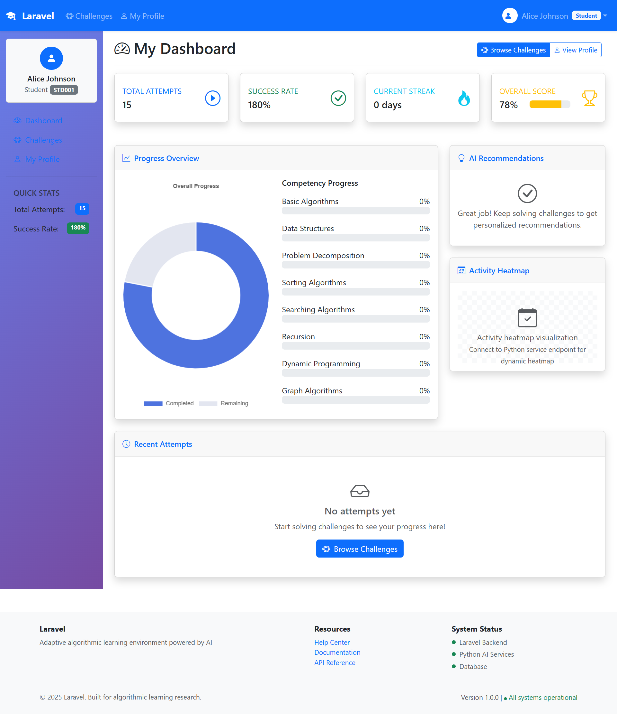
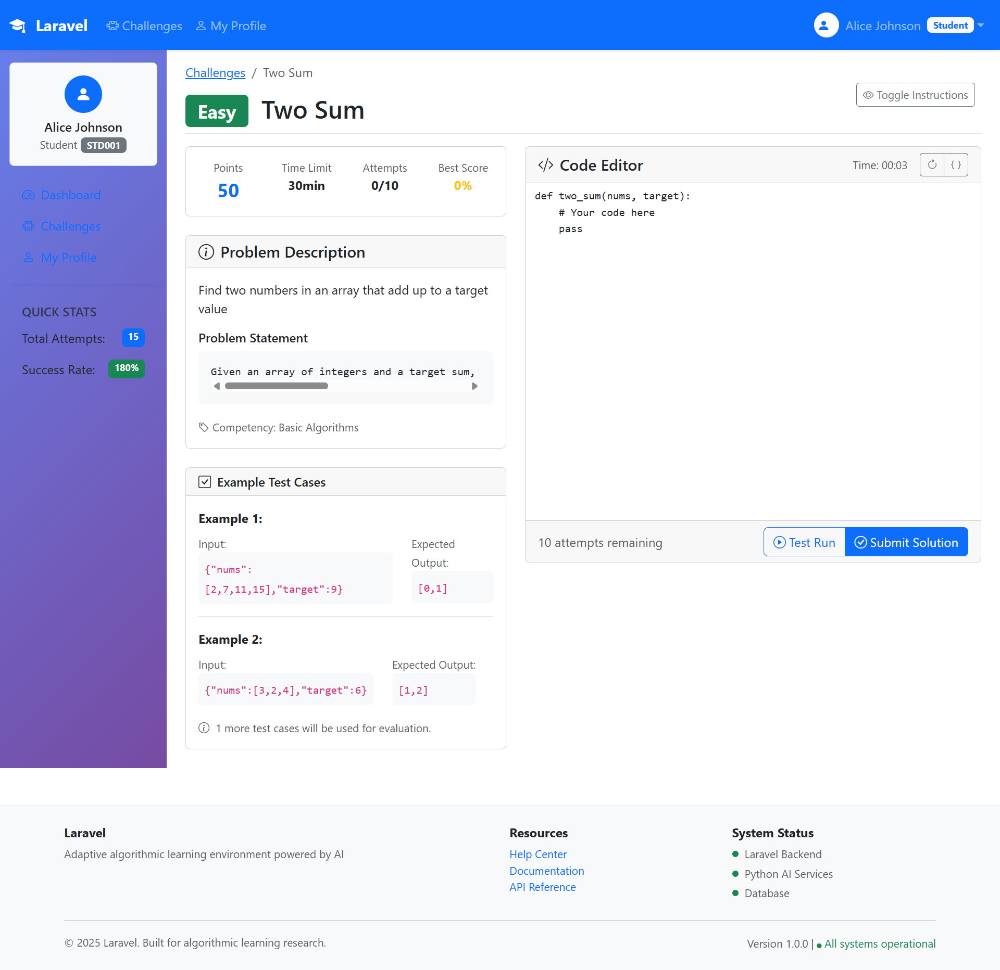
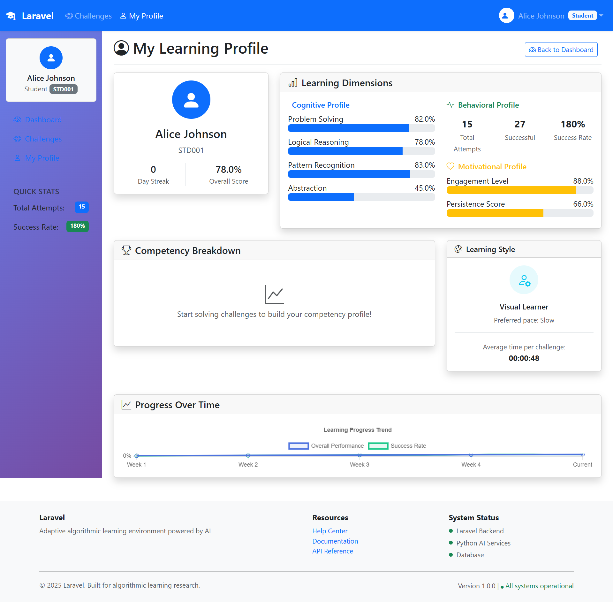
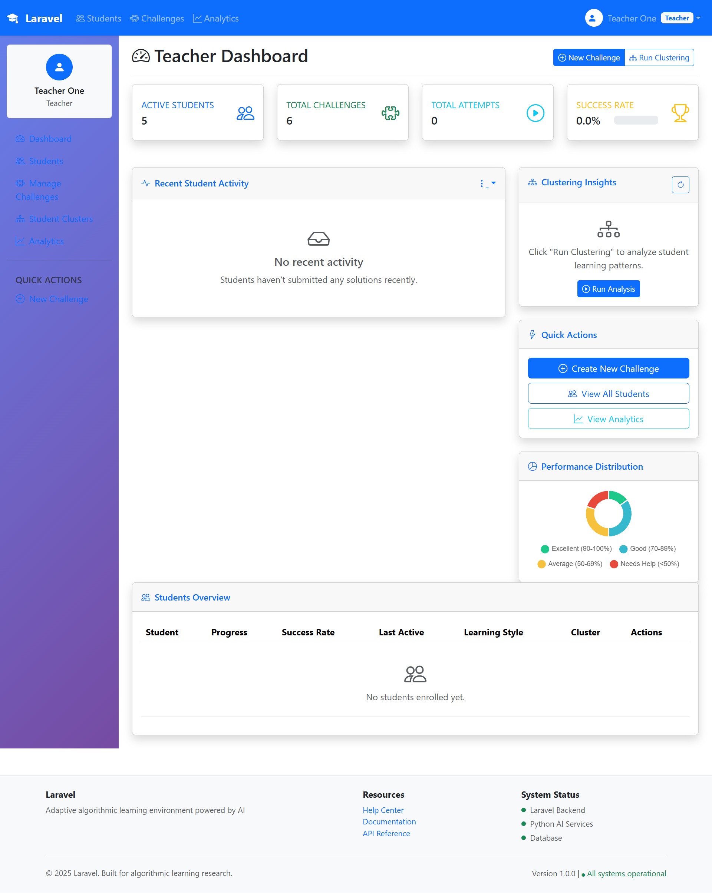
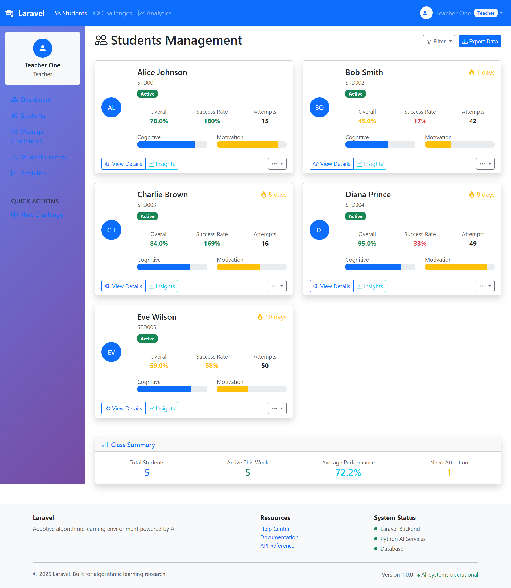
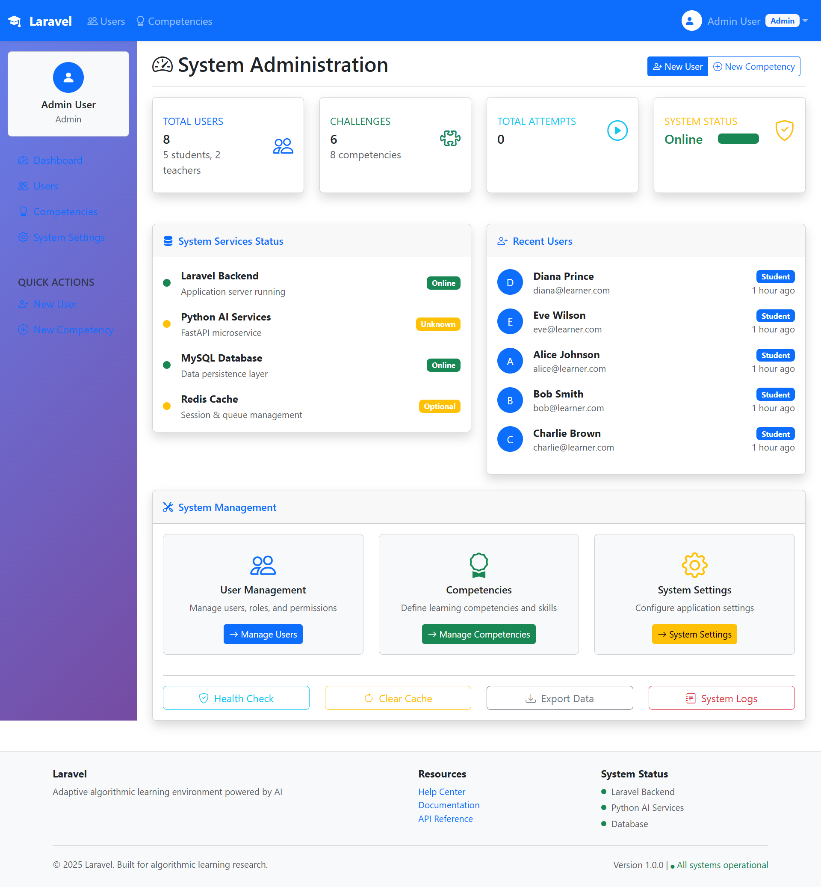

# Learner Environment Platform

An adaptive algorithmic learning environment combining Laravel backend with FastAPI AI microservices for code evaluation, student clustering, and personalized recommendations.

## Architecture Overview

- **Frontend**: Laravel web application with Blade templates
- **Backend**: PHP 8.2+ with MySQL database
- **AI Services**: FastAPI microservice for code evaluation and machine learning
- **Containerization**: Docker Compose for development environment

## Quick Access Links

- **Main Application**: http://localhost:8080
- **AI Microservice**: http://localhost:8000 (internal), http://python_service:8000 (container network)
- **Database Admin**: http://localhost:8081 (Adminer)

## Core Features

### For Students
- Interactive coding challenges with starter templates
- Real-time code evaluation and testing
- AI-powered feedback and personalized hints
- Progress tracking and competency mapping
- Adaptive difficulty adjustment

### For Teachers
- Student performance analytics dashboard
- AI-driven clustering of learning patterns
- Challenge creation and management tools
- Detailed attempt analysis and reporting

### For Administrators
- User and role management
- System monitoring and health checks
- Database seeding and maintenance tools

## Project Structure

```
learner-env/
├── app/                    # Laravel application logic
│   ├── Http/Controllers/   # Web controllers
│   └── Models/            # Eloquent models
├── database/
│   ├── migrations/        # Database schema
│   └── seeders/          # Demo data generation
├── resources/views/       # Blade templates
├── python_service/        # AI microservice
│   ├── main.py           # FastAPI application
│   ├── evaluator.py      # Code evaluation service
│   ├── cluster.py        # Student clustering service
│   ├── profile.py        # Learner profile management
│   ├── expert_rules.py   # Expert system rules
│   └── requirements.txt  # Python dependencies
├── docker/               # Docker configuration
├── docker-compose.yml    # Container orchestration
└── Dockerfile           # PHP-FPM container
```

## System Requirements

### Docker Development (Recommended)
- Docker Engine 20.10+
- Docker Compose 2.0+
- 4GB+ available RAM
- WSL2 (Windows users)

### Local Development
- PHP 8.2+
- Composer 2.0+
- MySQL 8.0+
- Node.js 18+
- Python 3.10+

## Screenshots of the project:










 - [] - Not finished




## Installation Guide

### Docker Setup (Recommended)

1. **Clone and configure environment**:
   ```bash
   git clone <repository-url>
   cd learner-env
   cp .env.example .env
   ```

2. **Build and start containers**:
   ```bash
   docker compose up -d --build
   ```

3. **Verify container health**:
   ```bash
   docker compose ps
   docker logs learner-python
   docker logs learner-php
   ```

4. **Initialize database**:
   ```bash
   docker exec -it learner-php bash
   php artisan migrate:fresh --seed
   php artisan key:generate
   exit
   ```

### Local Development Setup

1. **Install PHP dependencies**:
   ```bash
   composer install
   ```

2. **Install Node.js dependencies**:
   ```bash
   npm install && npm run dev
   ```

3. **Configure database and generate keys**:
   ```bash
   php artisan key:generate
   php artisan migrate:fresh --seed
   ```

4. **Start Laravel development server**:
   ```bash
   php artisan serve --host=127.0.0.1 --port=8080
   ```

5. **Start Python AI service**:
   ```bash
   cd python_service
   python -m venv venv
   source venv/bin/activate  # Windows: venv\Scripts\activate
   pip install -r requirements.txt
   uvicorn main:app --host 0.0.0.0 --port 8000 --reload
   ```

## AI Service Testing

### Health Check
```bash
# From host
curl http://localhost:8000/health

# From container
docker exec -it learner-php bash
curl http://python_service:8000/health
```

### Clustering Service Test
```bash
# Basic clustering test
curl -X POST http://localhost:8000/cluster \
  -H "Content-Type: application/json" \
  -d '{"min_clusters":3,"max_clusters":6}'

# Custom feature data test
curl -X POST http://localhost:8000/cluster \
  -H "Content-Type: application/json" \
  -d '{
    "min_clusters":2,
    "max_clusters":4,
    "feature_data":[
      {"cognitive_score":80,"behavioral_score":60,"motivational_score":70},
      {"cognitive_score":90,"behavioral_score":85,"motivational_score":95}
    ]
  }'
```

### Code Evaluation Test
```bash
curl -X POST http://localhost:8000/evaluate \
  -H "Content-Type: application/json" \
  -d '{
    "code":"def add(a,b): return a+b",
    "test_cases":[
      {"input":{"a":2,"b":3},"output":5},
      {"input":{"a":10,"b":5},"output":15}
    ]
  }'
```

## Troubleshooting Common Issues

### Container Communication Problems

**Diagnosis**: Container cannot reach Python service

**Solution**: Verify service names in docker-compose.yml match your requests:
```bash
# From PHP container, use service name
curl http://python_service:8000/health

# From host, use mapped port
curl http://localhost:8000/health
```

### PHP Version Compatibility

**Diagnosis**: Composer platform check fails with "PHP >= 8.2.0 required"

**Solution**: Update Dockerfile base image:
```dockerfile
FROM php:8.4-fpm
```

### Database Seeding Conflicts

**Diagnosis**: Duplicate entry errors during seeding

**Solution**: Fresh migration with seed data:
```bash
php artisan migrate:fresh --seed
```

### Broadcasting Error in Clustering

**Diagnosis**: NumPy shape mismatch in clustering service

**Solution**: The updated cluster.py handles dimensional validation automatically. Ensure feature_data arrays have consistent structure:
```json
{
  "feature_data": [
    {"cognitive_score": 75, "behavioral_score": 65, "motivational_score": 80},
    {"cognitive_score": 85, "behavioral_score": 75, "motivational_score": 90}
  ]
}
```

### View Template Missing

**Diagnosis**: Blade view not found error

**Solution**: Ensure view files match route names:
- Route: `teacher.clusters` → File: `resources/views/teacher/clusters.blade.php`

## Demo Accounts

After running seeders, these accounts are available:

| Role | Email | Password |
|------|-------|----------|
| Admin | admin@learner.com | password |
| Teacher | teacher@learner.com | password |
| Student | alice@learner.com | password |

## Performance Optimization

### Development Environment
- Disable Xdebug when not debugging
- Use optimized autoloader: `composer dump-autoload -o`
- Clear configuration cache: `php artisan config:clear`
- Enable PHP OPcache in production

### Docker on Windows
- Use WSL2 for better filesystem performance
- Consider named volumes for `vendor/` and `node_modules/`
- Use `:cached` or `:delegated` mount options for large directories

## AI Service Architecture

The Python microservice provides four main endpoints:

1. **`/evaluate`**: Secure code execution with test case validation
2. **`/cluster`**: Student grouping based on performance patterns
3. **`/update_profile`**: Learner behavior and competency tracking
4. **`/recommend`**: Personalized feedback generation

### Service Health Monitoring
```bash
# Detailed health check
curl http://localhost:8000/health

# Service statistics
curl http://localhost:8000/stats
```

## Development Workflow

### Feature Development
1. Create feature branch: `git checkout -b feature/improvement-name`
2. Implement changes with tests
3. Verify container functionality
4. Submit pull request

### Testing Checklist
- [x] Container services start successfully
- [x] Database migrations execute cleanly
- [x] Python service health checks pass
- [x] Web interface loads without errors
- [ ] AI endpoints respond correctly

## Contributing Guidelines

- Keep changes focused and well-documented
- Include test cases for new functionality
- Follow PSR-12 coding standards for PHP
- Use type hints in Python code
- Update documentation for API changes

## License

This project is released under the MIT License. See LICENSE file for details.

---

## Quick Reference Commands

```bash
# Start development environment
docker compose up -d

# Reset database with fresh data
docker exec -it learner-php php artisan migrate:fresh --seed

# View service logs
docker logs learner-python -f

# Execute commands in PHP container
docker exec -it learner-php bash

# Test AI service connectivity
curl -v http://localhost:8000/health

# Stop all services
docker compose down
```
